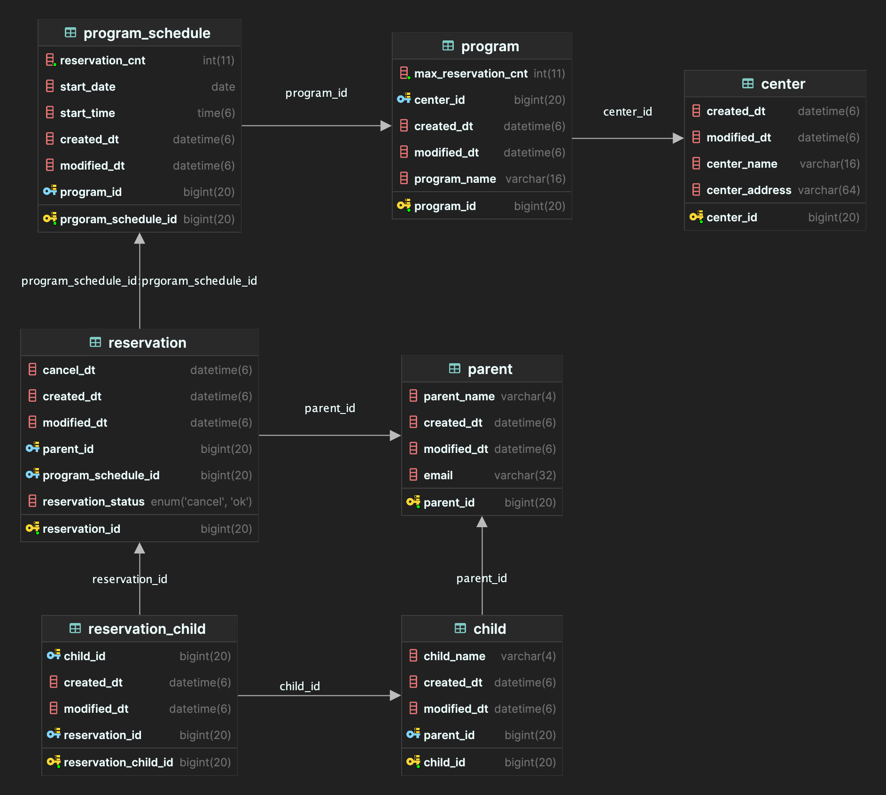

# 키즈 카페 예약 서비스

## 1. 개요
- 본 서비스는 "아이를 키우는 부모님들이 온라인으로 키즈 카페 수업을 예약한다"는 주제의 사이드 프로젝트입니다. 
  - 로그인, 보안, UI 와 같은 부가 기능은 적용하지 않은 간단한 API 서버입니다.
- 핵심 기능 : 특정 센터의 수업 예약 및 취소, 사용자 별 예약 이력 조회, 특정 센터/수업 별 에약자 조회 (관리자)

## 2. 요구 사항
### 2.1. 공통 
- 키즈 카페 매장은 전국에 프랜차이즈화 되어 있고 현재는 서울 잠실점 / 인천점 / 수원점이 있다고 설정되었다. 
- 각 키즈 카페 센터에는 다양한 프로그램이 존재하고, 각 센터별로 프로그램의 참여인원 / 수업 시간 등이 다를 수 있다.
- 각 수업의 최대 인원은 기본값이 20명이고 수업마다 변경될 수 있다.
- 각 수업 일정은 매달 다르게 정해질 수 있다.
- 예약 상태는 예약 완료(OK)와 예약 취소(CANCEL)이 있다.

### 2.2. 수업 예약 기능
- 과거 일의 수업 일정은 예약 할 수 없다. 
- 당일 수업 일정은 예약 할 수 없다. 
- 현재로부터 15일 이후의 수업 일정은 예약 할 수 없다.
- 사용자는 동일 매장, 동일 수업 일정에 두번 이상 예약할 수 없다.
- 사용자는 여러 아이를 한번에 예약할 수 있다.
- 예약하려는 아이 수가 수업의 현재 가용 인원 수를 초과한다면 예약할 수 없다.  

### 2.3. 수업 예약 취소 기능 
- 예약 취소 시, 예약 인원 만큼 수업 예약 가능 인원 수가 증가 한다.

### 2.4. 예약 이력 조회
- 매장 별로 예약 이력을 조회할 수 있다. 
- 매장 + 수업 별로 예약 이력을 조회할 수 있다.
- 날짜 별로 예약 이력을 조회할 수 있다. 
- 예약 상태 별로 예약을 조회할 수 있다.

### 2.5. 매장/수업 별 예약자 현황 조회 (관리자)
- 매장 별로 예약자 현황을 조회할 수 있다.
- 매장 + 수업 별로 예약자 현황을 조회할 수 있다.
- 날짜 별로 예약자 현황을 조회할 수 있다.
- 예약자 이름으로 조회할 수 있다.

## 3. 프로젝트 환경 
- JDK 17
- Spring Boot 3.1.8
- Spring Data JPA & QueryDSL
- gradle
- Swagger 2.3.0
- p6spy
- Lombok

## 4. DB 설계
### 4.1. Domain 
1. Center : 매장 
2. Program : 매장 별 수업 
   - 매장과 1대 N 관계
   - 매장 별로 수업의 정보가 상이할 수 있기 때문에 (ex) 수업 내용, 최대 인원 수), 매장에 종속적으로 설계했습니다.
3. Program_Schedule : 수업 별 일정 
   - 수업과 1대 N 관계
4. Parent : 예약자 (부모) 
5. Child : 예약 대상 (아이)
   - 부모와 1대 N 관계
6. Reservation : 예약 데이터 
   - FK : Program_Schedule, Parent
7. Reservation_Child : 예약 별 아이 목록 
   - FK : Reservation, Child
   - 다대 다 연결 테이블
   
### 4.2. ERD

## 5. API 목록
- 매장 별 수업 예약 API
- 수업 예약 취소 API 
- 매장 별 수업 별 예약자 현황 조회 API
- 사용자 별 예약 이력 조회 API

📌 상세 내용은 http://localhost:8080/swagger-ui 에서 확인할 수 있습니다. 

